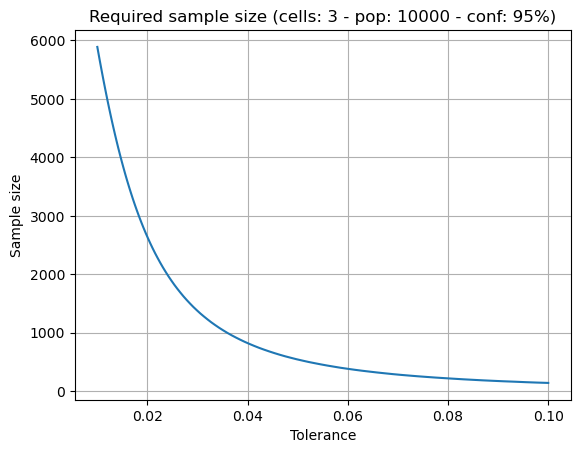

# Sample Size Estimation for Multinomial Populations

An implementation of the procedure for estimating sample size for multinomial populations by Tortora [1]. The method is based on the classical confidence interval for multinomial proportions according to Goodman [2].

## Prerequisites

The code was tested under Python 3.9. The packages numpy, scipy and matplotlib are required.

## Usage

To be able to import the module, add the base directory of this repository to your `PYTHONPATH` environment variable

```
$ export PYTHONPATH="${PYTHONPATH}:/path/to/repo"
```

After that the class can be imported via

```python
from multinomial_estimation import MultinomialEstimator
```

### Usecase 1: Determination of a confidence interval for multinomial population

If an observation of cell counts is given and a point estimate or confidence interval for the proportions of the underlying multinomial distribution is to be determined, this can be done as follows

```python
estimator = MultinomialEstimator(
    num_cells=3,
    alpha=0.05
).fit(
    cell_frequencies=[25, 5, 70]
)
# Point estimate
print(estimator.proportions)
# 95% confidence interval
print(estimator.confidence_intervals)
```

The attribute `proportions` returns the MLE point estimate for the multinomial proportions as a numpy array of the shape `(num_cells, )`. The attribute `confidence_intervals` gives us the 95% confidence intervals (according to the parameter alpha). Confidence intervals are returned as a numpy array of the shape `(num_cells, 2)`, where the first column corresponds to the lower bound and the second column to the upper bound.

### Usecase 2: Determination of sample size for estimation of multinomial proportions.

In this case, we want to determine how large the sample drawn from the population should be in order to estimate the multinomial proportions to a certain tolerance. We can optionally give estimates for the porportions from previous experiments. If such values are not available, a worst case analysis is performed. We can also specify the size of the population from which to draw the sample, if known. An example might look like this

```python
estimator = MultinomialEstimator(
    num_cells=3,
    tolerance=0.01,
    alpha=0.05
).fit(
    population_size=10000
)
print(estimator.required_sample_size)
```

In this example, the underlying question might be: how large does my sample need to be to report the proportions of a multinomial population of 10000 individuals falling into three categories with a tolerance of ±0.01 to a 95% significance level?

The `MultinomialEstimator` class also has a class method `plot_sample_size()` which allows the required sample size to be plotted against the desired tolerance (to the otherwise fixed other parameters). To see how such a plot can be generated, please see the example in `main/sample_size_example.py`.



## Literature

1. Tortora, Robert D. (1978) "A Note on Sample Size Estimation for Multinomial Populations"
2. Goodman, Leo A. (1965) "On Simultaneous Confidence Intervals for Multinomial Proportions"